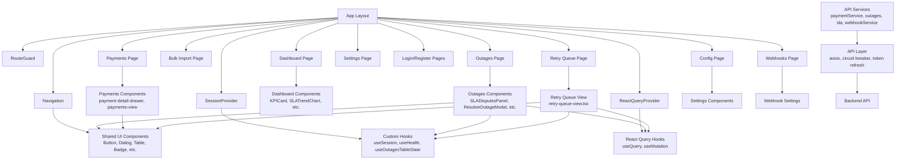
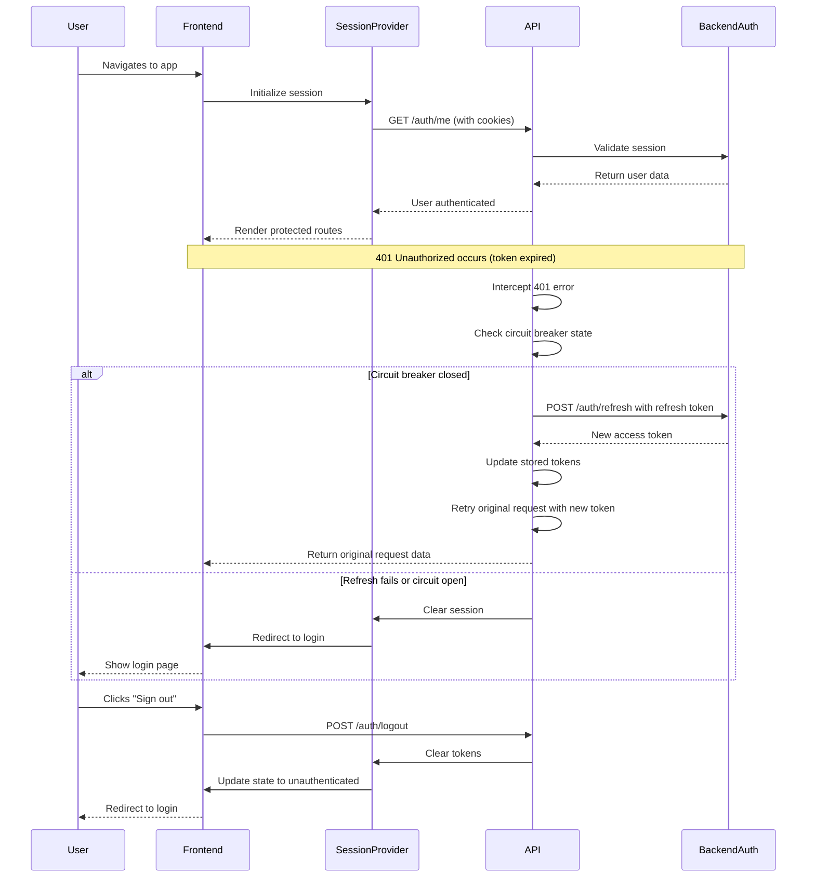
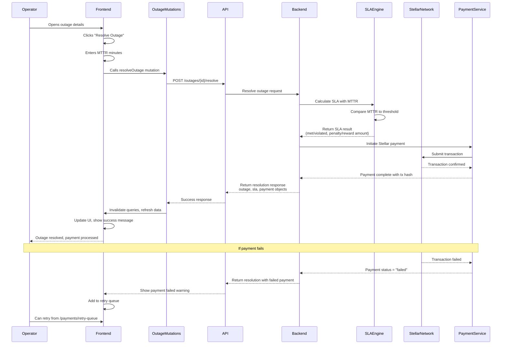

# ApexChain Architecture

This document contains architectural diagrams that visualize ApexChain's component structure and key data flows.

## Table of Contents
- [Frontend Component Tree](#frontend-component-tree)
- [Auth/Refresh Flow](#authrefresh-flow)
- [Outage Resolve Flow with SLA + Stellar Payment](#outage-resolve-flow-with-sla--stellar-payment)

---

## Frontend Component Tree

---

## Auth/Refresh Flow

---

## Outage Resolve Flow with SLA + Stellar Payment

---

## Key Code Path References

### Frontend Component Tree Implementation
- **Session Provider**: [`src/providers/session.tsx`](../src/providers/session.tsx) - Manages authentication state
- **React Query Provider**: [`src/providers/react-query.tsx`](../src/providers/react-query.tsx) - Manages server state caching
- **Retry Queue View**: [`src/components/payments/retry-queue-view.tsx`](../src/components/payments/retry-queue-view.tsx) - Failed payments retry interface
- **Route Guard**: [`src/components/RouteGuard.tsx`](../src/components/RouteGuard.tsx) - Protects authenticated routes

### Auth Flow Implementation
- **Token Refresh Logic**: [`src/lib/api.ts`](../src/lib/api.ts) - Axios interceptors with circuit breaker pattern
- **Session Management**: [`src/providers/session.tsx`](../src/providers/session.tsx) - Cross-tab session sync, login/logout
- **API Layer**: [`src/lib/api.ts`](../src/lib/api.ts) - Deduplication, circuit breaker, auto-refresh

### Outage Resolution Flow
- **Outage Mutations**: [`src/features/outages/hooks/useOutageMutations.ts`](../src/features/outages/hooks/useOutageMutations.ts) - React Query mutations for outages
- **Resolve Outage Service**: [`src/services/outages.ts`](../src/services/outages.ts) - API calls for outage operations
- **Payment Service**: [`src/services/paymentService.ts`](../src/services/paymentService.ts) - Payment retry and management
- **SLA Types**: [`src/types/outages.ts`](../src/types/outages.ts) - SLAResult, OutageResolutionPayment interfaces

### Stellar Integration
- **Stellar Documentation**: [`docs/STELLAR_INTEGRATION.md`](./STELLAR_INTEGRATION.md) - Complete Stellar integration guide
- **Payment Endpoints**: [`src/lib/endpoints.ts`](../src/lib/endpoints.ts) - `/payments/{id}/retry` endpoint